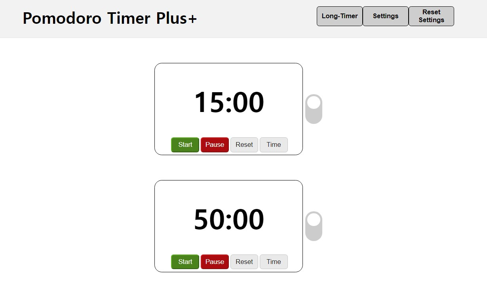
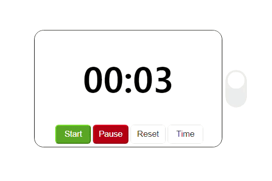
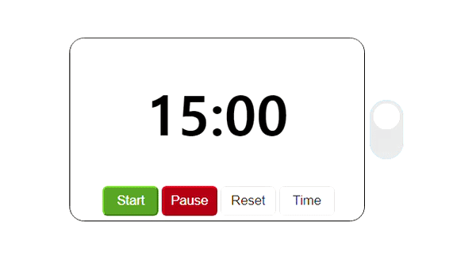
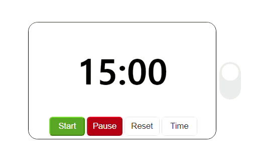

# Dual Timer with break mode

Easily get time notification for short breaks and long breaks in a single webpage

 

### Main timer and break mode

When the main timer is done, it automatically goes into break mode.

When the break is over, the timer ends (unless 'autostart' option is ON)

 

Manually switch modes

If you think you need another break, go ahead!

 

### Change clock - Writable clock

Change your clock settings by just click-and-write. 

All settings are saved for future re-visits.

 

### Keyboard shortcuts

* Space : (Toggle) start ↔ pause
* R : Resets main/break timer (break mode maintained)
* CTRL + R : Resets break timer back to the main timer

In settings window

* Space or Enter : save changes

